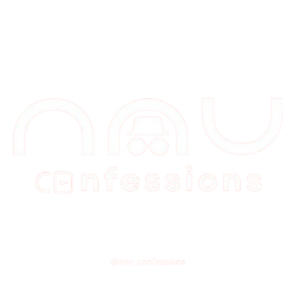

<!-- Improved compatibility of back to top link -->
<a id="readme-top"></a>


<!-- PROJECT LOGO -->
<br />
<div align="center">
  
  <h3 align="center">AAU Confessions Bot</h3>

  <p align="center">
    AAU Confessions is a safe space for Addis Ababa University students to share their untold stories, secrets, thoughts, and feelings completely anonymously.
    <br />
    <br />
    <a href="#about-the-project"><strong>Explore the docs »</strong></a>
  </p>
</div>


<!-- TABLE OF CONTENTS -->
<details>
  <summary>Table of Contents</summary>
  <ol>
    <li><a href="#about-the-project">About The Project</a>
      <ul>
        <li><a href="#built-with">Built With</a></li>
      </ul>
    </li>
    <li><a href="#getting-started">Getting Started</a>
      <ul>
        <li><a href="#prerequisites">Prerequisites</a></li>
        <li><a href="#installation">Installation</a></li>
      </ul>
    </li>
    <li><a href="#usage">Usage</a></li>
    <li><a href="#roadmap">Roadmap</a></li>
    <li><a href="#contributing">Contributing</a></li>
    <li><a href="#license">License</a></li>
    <li><a href="#contact">Contact</a></li>
    <li><a href="#acknowledgments">Acknowledgments</a></li>
  </ol>
</details>


<!-- ABOUT THE PROJECT -->
## About The Project

AAU Confessions Bot provides Addis Ababa University students with an anonymous Telegram space to share confessions, secrets, and thoughts safely. Each submission is reviewed by an admin before it’s posted publicly. Users can comment, react, and interact while staying anonymous.

Key features:
* Anonymous confession submission with multiple category tags
* Admin approval & rejection (with reason)
* Post to designated Telegram channel
* Deep links to view individual confessions
* Users can add comments (text, sticker, or GIF)
* Reactions on comments: 👍 / 👎
* User points/medals for activity & reputation
* Reporting system for inappropriate content
* Contact request system between authors & commenters
* Health-check server for deployment (Render)

<p align="right">(<a href="#readme-top">back to top</a>)</p>


### Built With

* [Python 3.x](https://www.python.org/)
* [Aiogram v3](https://docs.aiogram.dev/en/latest/)
* [asyncpg](https://magicstack.github.io/asyncpg/current/)
* [Aiohttp](https://docs.aiohttp.org/)
* [python-dotenv](https://pypi.org/project/python-dotenv/)

<p align="right">(<a href="#readme-top">back to top</a>)</p>


<!-- GETTING STARTED -->
## Getting Started

### Prerequisites

Create a `.env` file with:
```
BOT_TOKEN=<YOUR_TELEGRAM_BOT_TOKEN>
ADMIN_ID=<YOUR_TELEGRAM_USER_ID>
CHANNEL_ID=<YOUR_TELEGRAM_CHANNEL_ID>
DATABASE_URL=<YOUR_POSTGRES_CONNECTION_URL>
PORT=<PORT> (optional, for deployment)
```

Install Python packages:
```sh
pip install -r requirements.txt
```

### Installation

Clone the repository:

```sh
git clone https://github.com/your_username/aau-confessions-bot.git
cd aau-confessions-bot
```

Run the bot:

```sh
python main_render.py
```

<p align="right">(<a href="#readme-top">back to top</a>)</p>


<!-- USAGE EXAMPLES -->
## Usage

- Users send `/confess` to submit an anonymous confession.
- They choose up to 3 categories.
- Admin gets a review prompt to approve or reject.
- Approved confessions post to the channel with comment/reaction buttons.
- Users can comment using text, stickers, or GIFs.
- Comments can be liked/disliked and reported.
- Confession authors can request contact with commenters.

<p align="right">(<a href="#readme-top">back to top</a>)</p>


<!-- ROADMAP -->
## Roadmap

- [x] Anonymous multi-category confessions
- [x] Admin review system
- [x] Deep link to view individual confessions
- [x] Comment & reaction system
- [x] User points & medal system
- [x] Contact request feature
- [ ] Web admin dashboard (future)
- [ ] Multi-language support (future)

<p align="right">(<a href="#readme-top">back to top</a>)</p>


<!-- CONTRIBUTING -->
## Contributing

This project is currently **private** and not accepting external contributions.

<p align="right">(<a href="#readme-top">back to top</a>)</p>


<!-- LICENSE -->
## License

This project is currently distributed under the **Unlicense License** — not open for redistribution.

<p align="right">(<a href="#readme-top">back to top</a>)</p>


<!-- CONTACT -->
## Contact

**Addisu Derrese** — [Email](mailto:addisu@example.com)

Project Link: [https://github.com/your_username/aau-confessions-bot](https://github.com/your_username/aau-confessions-bot)

<p align="right">(<a href="#readme-top">back to top</a>)</p>


<!-- ACKNOWLEDGMENTS -->
## Acknowledgments

- [Aiogram Docs](https://docs.aiogram.dev/)
- [Render.com](https://render.com)
- [Shields.io](https://shields.io)

<p align="right">(<a href="#readme-top">back to top</a>)</p>


<!-- MARKDOWN LINKS & IMAGES -->
[contributors-shield]: https://img.shields.io/github/contributors/your_username/aau-confessions-bot.svg?style=for-the-badge
[contributors-url]: https://github.com/your_username/aau-confessions-bot/graphs/contributors
[forks-shield]: https://img.shields.io/github/forks/your_username/aau-confessions-bot.svg?style=for-the-badge
[forks-url]: https://github.com/your_username/aau-confessions-bot/network/members
[stars-shield]: https://img.shields.io/github/stars/your_username/aau-confessions-bot.svg?style=for-the-badge
[stars-url]: https://github.com/your_username/aau-confessions-bot/stargazers
[issues-shield]: https://img.shields.io/github/issues/your_username/aau-confessions-bot.svg?style=for-the-badge
[issues-url]: https://github.com/your_username/aau-confessions-bot/issues
[license-shield]: https://img.shields.io/github/license/your_username/aau-confessions-bot.svg?style=for-the-badge
[license-url]: https://github.com/your_username/aau-confessions-bot/blob/main/LICENSE.txt
